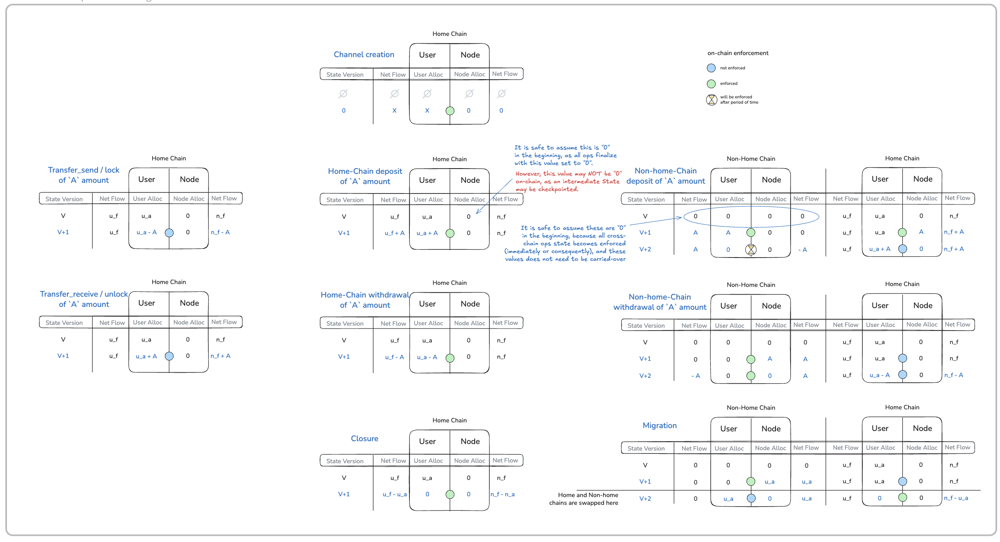

# Channel Protocol

Previous: [State Model](state-model.md) | Next: [Enforcement and Settlement](enforcement.md)

---

This document describes how channels operate and how states evolve through off-chain state advancement.

## Purpose

Channels are the primary mechanism for off-chain interaction in the Nitrolite protocol. They allow participants to exchange assets and update state without on-chain transactions.

## Channel Definition

A channel is defined by a set of immutable parameters fixed at creation time.

| Field                       | Description                                                    |
| --------------------------- | -------------------------------------------------------------- |
| User                        | Identifier of the user participant                             |
| Node                        | Identifier of the node participant                             |
| Asset                       | Identifier of the asset operated within the channel            |
| Nonce                       | Unique nonce to distinguish channels with identical parameters |
| ChallengeDuration           | Challenge period duration in seconds                           |
| ApprovedSignatureValidators | Bitmask of approved signature validation modes                 |

The channel definition MUST NOT change after creation.

## Channel Identifier

The channel identifier is derived deterministically from the channel definition using canonical encoding and hashing.

The derivation produces a 32-byte identifier where:

- the first byte encodes the smart contract version
- the remaining bytes are derived from the hash of the canonical encoded channel definition parameters

This ensures that:

- each unique channel definition produces a unique identifier
- the identifier can be independently computed by any party
- no central authority is required to assign identifiers
- identifiers are scoped to a specific protocol version

## Channel Lifecycle

A channel progresses through four primary actions.

**Create** *(off-chain, then optionally on-chain)*
The node validates and stores the channel definition. An initial state is constructed and signed by all participants. This initial state MAY subsequently be submitted to the blockchain layer for on-chain enforcement, or any later state with a higher version MAY be used instead.

**Checkpoint** *(off-chain, then optionally on-chain)*
The node validates and stores a new state off-chain. Depending on the transition type or a participant's initiative, the node MAY also submit the state to the blockchain layer for on-chain enforcement. Any party MAY independently submit a signed state to the blockchain layer.

**Challenge** *(on-chain only)*
A participant submits a signed state along with a challenger signature to the blockchain layer. Upon successful validation, the challenge duration begins. During this period, other participants MAY respond by submitting a state with a higher version (if exists) via checkpoint to refute the challenge.

**Close** *(off-chain for cooperative, on-chain for execution)*
Off-chain, a close represents a mutual agreement to finalize the channel. On-chain, a close MAY be executed either through a mutually signed close state or after the challenge duration has elapsed without a successful response. Upon close, the channel's funds are released according to the final state allocations and the channel's lifecycle ends.

## State Signing Categories

During the channel lifecycle, states exist in one of the following signing categories:

**Mutually signed state** — a state that carries valid signatures from both the user and the node. This is the authoritative off-chain state and the only category that is enforceable on-chain.

**Node-issued pending state** — a state produced by the node (e.g. for TransferReceive or Release transitions) that carries only the node's signature. A pending state is not enforceable on-chain and MUST NOT be treated as the latest authoritative state. It becomes mutually signed only after the user acknowledges it.

The off-chain and enforcement representations encode the same logical state. A state that is mutually signed off-chain is directly enforceable on-chain without transformation, provided the enforcement representation is derived correctly. Session-key signatures are valid for enforcement if the channel's approved signature validators include the session key validator.

## State Advancement Rules

When a new state is proposed during off-chain advancement, the following general rules apply:

**Version validation**
The state version MUST equal the current version incremented by one.

**Signature validation**
A valid signature from the proposing participant MUST be present. The signature validation mode MUST be among the channel's approved signature validators.

**Channel binding**
The channel identifier MUST be present and MUST match the channel definition.

**Transition admissibility**
The transition type MUST be valid for the current channel state. Transition-specific validation rules MUST be satisfied.

**Ledger admissibility**
Ledger invariants MUST hold: allocations MUST equal net flows, and allocation values MUST be non-negative. Declared decimal precision MUST match the asset's actual precision. Additionally, transition-specific ledger validations apply.

## Transition Families

Transitions are organized into the following families:

**Local channel transitions** — operations that affect the channel's home ledger directly: Home Deposit, Home Withdrawal, Finalize.

**Transfer transitions** — operations that move assets between users via the node: TransferSend, TransferReceive, Acknowledgement.

**Extension bridge transitions** — operations that move assets between the channel and an extension: Commit, Release.

**Cross-chain escrow transitions** — operations that manage cross-chain deposits and withdrawals through escrow: Escrow Deposit Initiate, Escrow Deposit Finalize, Escrow Withdrawal Initiate, Escrow Withdrawal Finalize.

**Migration transitions** — operations that move the channel's home chain: Migration Initiate, Migration Finalize.

## Transitions

Each transition below describes its purpose, the expected transition field values, and the resulting ledger effects. Ledger fields are abbreviated as: UB (UserAllocation), UNF (UserNetFlow), NB (NodeAllocation), NNF (NodeNetFlow).

For all transitions that do not modify the non-home ledger, the non-home ledger MUST be empty (see [Empty Non-Home Ledger](state-model.md#empty-non-home-ledger)).

State Ledgers Operation-specific advancement diagram:

### Acknowledgement

- Purpose: allows the user to acknowledge and sign a pending node-issued state
- Acknowledgement creates a new state version. The new state is identical to the pending node-issued state in all fields except version (incremented by one) and the addition of the user's signature
- Valid only when the current state has no user signature
- Applies only to node-issued pending states (TransferReceive, Release)
- A node-issued pending state is NOT enforceable on-chain before acknowledgement, because it lacks the user's signature
- The non-home ledger MUST be empty

### Home Deposit

- Purpose: records an asset deposit from the home chain into the channel
- AccountId MUST reference the home channel identifier
- Amount MUST be the deposited quantity
- Home ledger effects: UB increases by Amount, UNF increases by Amount
- The non-home ledger MUST be empty
- Requires an on-chain checkpoint to lock the deposited assets

### Home Withdrawal

- Purpose: records an asset withdrawal from the channel to the home chain
- AccountId MUST reference the home channel identifier
- Amount MUST be the withdrawn quantity
- Home ledger effects: UB decreases by Amount, UNF decreases by Amount
- The non-home ledger MUST be empty
- Requires an on-chain checkpoint to release the withdrawn assets

### TransferSend

- Purpose: transfers assets from the user to a counterparty via the node
- AccountId MUST reference the receiver's address
- Amount MUST be the transfer quantity
- TxId uniquely identifies this transfer and is used to correlate with the corresponding TransferReceive on the receiver's channel
- Home ledger effects: UB decreases by Amount, NNF decreases by Amount
- The non-home ledger MUST be empty

### TransferReceive

- Purpose: records an inbound transfer from a counterparty via the node
- AccountId MUST reference the sender's address
- Amount MUST exactly match the sender's TransferSend amount (no scaling or normalization; transfers require the same unified asset)
- TxId MUST match the TxId from the corresponding TransferSend
- Home ledger effects: UB increases by Amount, NNF increases by Amount
- The non-home ledger MUST be empty
- This is a node-issued pending state: it carries only the node's signature and MUST NOT be considered the last mutually signed state until the user acknowledges it

### Commit

- Purpose: moves assets from the channel into an extension (such as an application session)
- AccountId MUST reference the extension object identifier (e.g. application session id)
- Amount MUST be the committed quantity
- Home ledger effects: UB decreases by Amount, NNF decreases by Amount
- The non-home ledger MUST be empty

### Release

- Purpose: returns assets from an extension back to channel allocations
- AccountId MUST reference the extension object identifier (e.g. application session id)
- Amount MUST be the released quantity
- The extension state MUST authorize the release
- Home ledger effects: UB increases by Amount, NNF increases by Amount
- The non-home ledger MUST be empty
- This is a node-issued pending state: it carries only the node's signature and MUST NOT be considered the last mutually signed state until the user acknowledges it

### Escrow Deposit Initiate

- Purpose: initiates a cross-chain deposit by creating an escrow between the home and non-home chains
- AccountId MUST reference the escrow channel identifier (derived from the home channel identifier and state version)
- Amount MUST be the deposit quantity
- A non-home ledger MUST be provided in the state
- The non-home ledger MUST have a different blockchain identifier than the home ledger
- Home ledger effects: NB increases by Amount, NNF increases by Amount
- Non-home ledger is initialized: UB set to Amount, UNF set to Amount, NB and NNF set to zero

### Escrow Deposit Finalize

- Purpose: completes a cross-chain deposit previously initiated by an escrow deposit initiate
- AccountId MUST reference the escrow channel identifier
- Amount MUST match the amount from the initiating transition
- Home ledger effects: UB increases by Amount, NB decreases by Amount, NNF does not change
- Non-home ledger effects: UB decreases by Amount, NNF decreases by Amount

### Escrow Withdrawal Initiate

- Purpose: initiates a cross-chain withdrawal by creating an escrow on the non-home chain
- AccountId MUST reference the escrow channel identifier (derived from the home channel identifier and state version)
- Amount MUST be the withdrawal quantity
- A non-home ledger MUST be provided in the state
- The non-home ledger MUST have a different blockchain identifier than the home ledger
- Non-home ledger is initialized: NB set to Amount, NNF set to Amount, UB and UNF set to zero

### Escrow Withdrawal Finalize

- Purpose: completes a cross-chain withdrawal previously initiated by an escrow withdrawal initiate
- AccountId MUST reference the escrow channel identifier
- Amount MUST match the amount from the initiating transition
- Home ledger effects: UB decreases by Amount, NNF decreases by Amount
- Non-home ledger effects: UNF decreases by Amount, NB decreases by Amount

### Migration Initiate

- Purpose: initiates migration of the channel from the current home chain to a different chain
- AccountId MUST reference the escrow channel identifier
- A non-home ledger MUST be provided in the state
- On the home chain (outgoing): UB MUST remain unchanged, UNF MUST NOT change, NB MUST be zero; the non-home ledger NB MUST equal the home ledger UB (normalized by decimal precision), non-home NNF MUST equal non-home NB, non-home UB and UNF MUST be zero
- On the non-home chain (incoming): the blockchain layer internally swaps ledgers so the non-home ledger becomes the home ledger; NB MUST equal the user allocation from the originating chain (normalized by decimal precision), NNF MUST equal NB, UB MUST be zero, UNF MUST be zero; the node locks funds equal to NB

VERSION NOTE: Migration transitions are functional but may be refined in future protocol versions.

### Migration Finalize

- Purpose: completes a previously initiated migration
- The version MUST be the immediate successor of the migration initiate state
- On the new home chain: UB MUST equal the user allocation from the initiate state, NB MUST be zero, UNF and NNF MUST NOT change from the initiate state; the non-home ledger MUST be zeroed out; the channel transitions to operating status; no fund movement occurs
- On the old home chain: the blockchain layer internally swaps ledgers before validation; UB and NB on the old home MUST be zero; the non-home ledger carries the user allocation to the new chain; all locked funds are released and the channel is marked as migrated out

VERSION NOTE: Migration transitions are functional but may be refined in future protocol versions.

### Finalize

- Purpose: indicates cooperative intent to close the channel and release all funds
- AccountId MUST reference the home channel identifier
- Amount MUST equal the user's current UB
- Home ledger effects: UNF decreases by the current UB, UB is set to zero
- The non-home ledger MUST be empty — open escrows or incomplete migrations MUST be resolved before finalization
- All participants MUST sign
- Final allocations become the settlement distribution
- NodeAllocation on finalization reflects the node's remaining share

## Atomicity and Dependent State Changes

Certain transitions produce side effects that create or modify states in other channels. The entire advancement — including all dependent state changes — MUST succeed or fail as a whole.

**TransferSend** — when the node accepts a TransferSend, it MUST atomically create the corresponding TransferReceive state on the receiver's channel. If receiver-side state creation fails, the sender-side advancement MUST also fail.

**Release** — when an extension releases assets, the node MUST atomically create the Release state on the user's channel.

**Cross-chain escrow transitions** — escrow initiate and finalize operations MAY trigger on-chain actions (escrow creation, fund locking) that MUST be coordinated with the off-chain state change.

## Checkpoint-Relevant Transitions

The following transitions require or MAY trigger a checkpoint to the blockchain layer. These are all transitions whose intent does not map to OPERATE:

| Transition                 | Intent                     | Checkpoint Behaviour                        |
| -------------------------- | -------------------------- | ------------------------------------------- |
| Home Deposit               | DEPOSIT                    | Required to lock deposited assets           |
| Home Withdrawal            | WITHDRAW                   | Required to release withdrawn assets        |
| Escrow Deposit Initiate    | INITIATE_ESCROW_DEPOSIT    | Required to create escrow on non-home chain |
| Escrow Deposit Finalize    | FINALIZE_ESCROW_DEPOSIT    | Required to complete cross-chain deposit    |
| Escrow Withdrawal Initiate | INITIATE_ESCROW_WITHDRAWAL | Required to create escrow for withdrawal    |
| Escrow Withdrawal Finalize | FINALIZE_ESCROW_WITHDRAWAL | Required to release assets on non-home chain|
| Migration Initiate         | INITIATE_MIGRATION         | Required to begin chain migration           |
| Migration Finalize         | FINALIZE_MIGRATION         | Required to complete chain migration        |
| Finalize                   | CLOSE                      | Required to settle and release funds        |

Any transition MAY also be checkpointed at a participant's discretion to enforce the current state on-chain. Any party MAY independently submit a validly signed state to the blockchain layer.

---

Previous: [State Model](state-model.md) | Next: [Enforcement and Settlement](enforcement.md)
